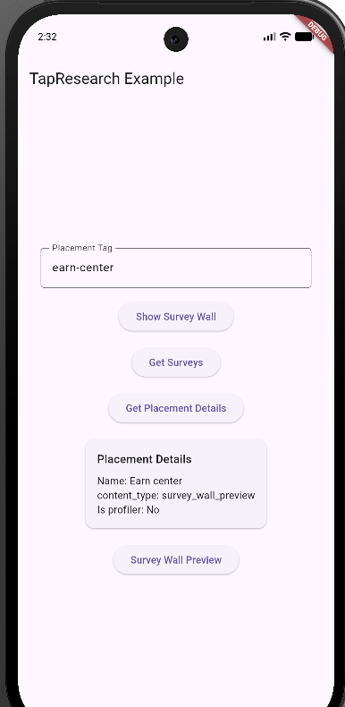
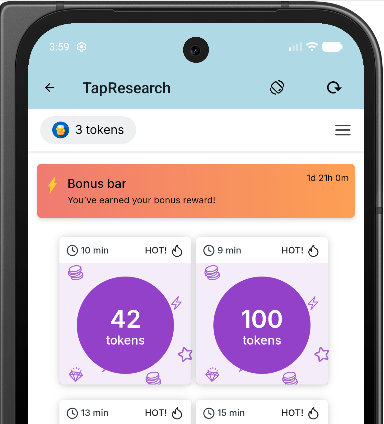
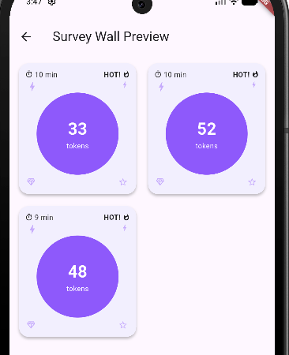

# tapresearch_flutter_plugin

In-app Monetization SDK via Surveys by TapResearch

## What This Is

A Flutter plugin that wraps the native TapResearch SDK. 
The plugin uses Flutter's standard method channel pattern to bridge Dart code with 
native Swift (iOS) and Kotlin (Android) implementations.

## Supported Platforms
- iOS
- Android

## Getting Started

Run the example app bundled within this plugin.

> [!NOTE]
> You must have Flutter, Android SDK, Android Studio, and/or Xcode installed on your computer.

- First thing, start your emulator or connected device, then: 
  - cd example
  - flutter run

- Second, if you need to change the API TOKEN and/or User Identifier, please modify 
example/lib/main.dart and re-run.  However, the values provided in the example should work fine.

> [!NOTE]
> API TOKEN and User Identifier will be different for iOS and Android.

## Typical Usage

See example/lib/main.dart.  All the typical features are contained and implemented in main.dart.

### Initialization
- Plugin methods will only work after the SDK has been initialized and is ready.
- _plugin.initialize(..)

### Wait for onTapResearchSdkReady()
- implement TRSdkReadyCallback then add code to onTapResearchSdkReady()
- For example, at this point, you would want to display the screen, tiles or buttons that allow users to click and show surveys.

### Showing Surveys in Standard Wall
- _plugin.showContentForPlacement('YourPlacementTag')

### Getting Surveys for 'Survey Wall Preview' feature
- _plugin.getSurveysForPlacement('YourPlacementTag')

### Listening for new Surveys for 'Survey Wall Preview'
- _plugin.setSurveysRefreshedListener(..)
- implement TRSurveysRefreshedListener then add code to onSurveysRefreshedForPlacement()
- For example, at this point, if you are displaying a Survey Wall Preview screen, you would want to re-fetch and re-render the new survey tiles. 

### Collecting Rewards on Survey Completions
- implement TRRewardCallback then add code to onTapResearchDidReceiveRewards()

## Screenshots

Demonstrates most commonly used features

Standard Survey Wall provided by TapResearch SDK

Survey Wall Preview.  Demonstrates you can further customize the look and feel.